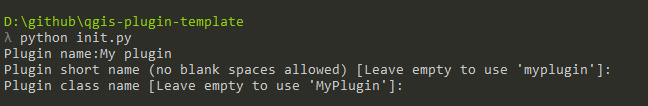

# qgis-plugin-template

A template for plugins.

## How to use it

Clone this repo or just copy its content in you system

Open a terminal in the folder where the content of this repo is found, and type `python init.py`.

You will be prompted to enter the name of your plugin, a short name (with no spaces, to be used for folder name, etc), and a class name. Default options for short name and class name will be proposed based on the plugin name,so you do not need to explicitely type them unless you want to use different names.

The script will modify the template files and leave the content of the folder ready to be used for creating your own plugin.

You might want to remove the `.git` folder, in case you have cloned the repo (the script will try to remove it, but that might fail in some cases), and the `init.py` file.

Notice that, since the script modifies the template files in place, once you run it, you will not be able to run it again (you can actually run it, but it won't work as expected). 

## What it contains

The created plugin template has the following elements

* An empty plugin class (`plugin.py` in the folder named with the short name of your plugin). 

* A `docs`folder with a Sphinx project. Edit the `docs/source/index.rst` file to add content. By default, t contains a single input file, `intro.rst`, which is empty.

* A `_lessons` folder in the plugin folder, with the required structure to add lessons by adding subfolders. A single sample lesson is added in a folder named `samplelesson`. Use that as template to add more lessons. Lessons will be automatically added when the plugin is loaded, since the necessary code is already in the plugin class constructor.

* A `tests` folder in the plugin folder, with the required structure to add tests for the Tester plugin. A `testerplugin.py` file is added, which contains sample unit and semi-automatede tests, to use as a starting point. Tests added to that file will be automatically added to the tester plugin when the plugin is loaded, since the necessary code is already in the plugin class constructor.

* A `travis.yml` file for Travis CI integration

* A `pavement.py` file with the following tasks:

	+ `setup`. Downloads and installs the required dependenciesfor the plugin  in the `ext-libs` folder. This folder is added to the PYTHONPATH by default by the plugin itself. The list of dependencies should be in the `requirements.txt` file, listing the PyPI names of the libraries, one per line.

	+ `install`. Installs the plugin into the `~/.qgis2/python/plugins` folder. It might copy the plugin folder itself, or create a symlink, depending on the OS. 

	+ `install-dev`. Installs the plugin into the `~/.qgis-dev/python/plugins` folder. It might copy the plugin folder itself, or create a symlink, depending on the OS. 

	+ `install3`. Installs the plugin into the `~/.qgis3/python/plugins` folder. It might copy the plugin folder itself, or create a symlink, depending on the OS. 

	+ `package`. Creates a `package.zip` file with the content of the file, ready to be published. It includes dependencies as well, but it will not download them, so the `setup` task has to be run before packaging. Accepts a `test`or `-t` parameter, which indicates that tests should also bepackaged. By default, tests are not added.

